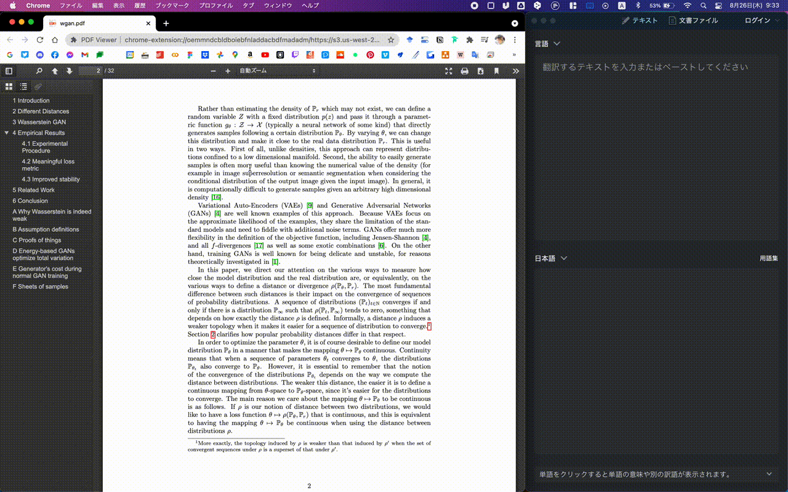

# karabiner-deepl4pdf
This is adeepL shortcut key for PDF. This erases the line break on deepL.

## Usage
- Run karabiner, and add `deepl4pdf.json`.
- Push `option + c`. (`command + c, command + l, command + v, command + a, command + c`)

